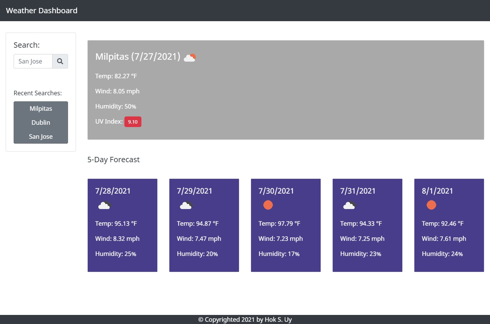

# Weather Dashboard
## Description
This is a web application that utilizes API calls from OpenWeather. This app leverages both the [One Call API](https://openweathermap.org/api/one-call-api) as well as the [Current Weather Data API](https://openweathermap.org/current) to display weather data for a specified city over the next 6-days. Visit the deployed application [here](https://hsengu.github.io/weather-dashboard).

## Built With
- HTML
- CSS
- JavaScript
- Bootstrap
- JQuery
- OpenWeather One Call API
- OpenWeather Current Weather API

## Screenshot

## Contributors
### Hok S. Uy
- HTML
- CSS
- JavaScript

### OpenWeather
- API